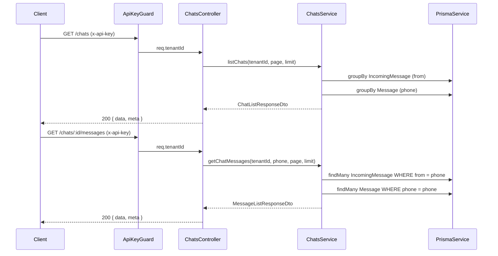

# Diseño Técnico: Chats API

## Overview

La Chats API expone dos endpoints REST dentro de la aplicación NestJS multi-tenant existente:

- `GET /chats` — lista los chats únicos del tenant autenticado, agrupados por número de teléfono, con metadatos de paginación.
- `GET /chats/:id/messages` — retorna el historial combinado de mensajes entrantes y salientes de un chat específico, con paginación.

Un "chat" es una agrupación lógica de mensajes identificada por número de teléfono. Los mensajes provienen de dos tablas distintas: `IncomingMessage` (campo `from`) y `Message` (campo `phone`). El tenant se determina a partir del API key autenticado mediante el `ApiKeyGuard` existente.

No se requieren cambios al esquema de base de datos. El módulo se integra al patrón NestJS existente: módulo propio, controlador, servicio, DTOs de respuesta.

---

## Architecture



### Decisiones de diseño

1. **Sin nueva tabla de chats**: Los chats se derivan en tiempo de consulta desde `IncomingMessage` y `Message`. Evita sincronización y migraciones adicionales.
2. **Fusión en memoria para paginación de mensajes**: Se obtienen los mensajes de ambas tablas filtrados por tenant+phone, se fusionan, ordenan por `createdAt` ASC y se pagina en memoria. Para volúmenes grandes se puede migrar a una vista SQL, pero para el alcance actual es suficiente.
3. **Paginación de chats con SQL**: Se usa `groupBy` de Prisma para obtener el conteo y la fecha del último mensaje directamente en la base de datos, evitando cargar todos los registros.

---

## Components and Interfaces

### Módulo: `ChatsModule`

```
src/modules/chats/
  chats.module.ts
  chats.controller.ts
  chats.service.ts
  dto/
    pagination-query.dto.ts
    chat-list-response.dto.ts
    message-list-response.dto.ts
```

### ChatsController

```typescript
@Controller('chats')
@UseGuards(ApiKeyGuard)
export class ChatsController {
  @Get()
  listChats(@Req() req, @Query() query: PaginationQueryDto): Promise<ChatListResponseDto>

  @Get(':id/messages')
  getChatMessages(
    @Req() req,
    @Param('id') phone: string,
    @Query() query: PaginationQueryDto,
  ): Promise<MessageListResponseDto>
}
```

### ChatsService

```typescript
export class ChatsService {
  listChats(tenantId: string, page: number, limit: number): Promise<ChatListResponseDto>
  getChatMessages(tenantId: string, phone: string, page: number, limit: number): Promise<MessageListResponseDto>
}
```

### PaginationQueryDto

```typescript
export class PaginationQueryDto {
  @IsOptional() @IsInt() @Min(1) @Type(() => Number)
  page?: number = 1;

  @IsOptional() @IsInt() @Min(1) @Max(100) @Type(() => Number)
  limit?: number = 20;
}
```

---

## Data Models

### Modelos Prisma existentes (sin cambios)

**IncomingMessage**
| Campo | Tipo | Descripción |
|-------|------|-------------|
| id | String (UUID) | PK |
| tenantId | String | FK a Tenant |
| messageId | String | ID único de WhatsApp |
| from | String | Número de teléfono del remitente |
| type | String | Tipo de mensaje |
| text | String? | Contenido de texto |
| raw | Json | Payload completo |
| createdAt | DateTime | Timestamp de recepción |

**Message**
| Campo | Tipo | Descripción |
|-------|------|-------------|
| id | String (UUID) | PK |
| tenantId | String | FK a Tenant |
| phone | String | Número de teléfono destino |
| type | String | Tipo de mensaje |
| messageId | String? | ID de WhatsApp (post-envío) |
| status | MessageStatus | QUEUED/SENT/DELIVERED/READ/FAILED |
| error | String? | Mensaje de error si falló |
| variables | Json? | Variables de template |
| createdAt | DateTime | Timestamp de creación |
| updatedAt | DateTime | Timestamp de última actualización |

### DTOs de respuesta

**ChatItemDto**
```typescript
{
  id: string;           // número de teléfono (chat ID)
  lastMessageAt: Date;  // fecha del mensaje más reciente
  messageCount: number; // total de mensajes en el chat
}
```

**ChatListResponseDto**
```typescript
{
  data: ChatItemDto[];
  meta: {
    total: number;
    page: number;
    limit: number;
    totalPages: number;
  };
}
```

**MessageItemDto**
```typescript
{
  id: string;
  direction: 'inbound' | 'outbound';
  type: string;
  text?: string;
  status?: string;      // solo para mensajes outbound
  createdAt: Date;
}
```

**MessageListResponseDto**
```typescript
{
  data: MessageItemDto[];
  meta: {
    total: number;
    page: number;
    limit: number;
    totalPages: number;
  };
}
```

### Lógica de fusión de chats

Para `GET /chats`, el servicio:
1. Consulta `IncomingMessage` agrupado por `from` para el `tenantId` → obtiene `count` y `max(createdAt)`.
2. Consulta `Message` agrupado por `phone` para el `tenantId` → obtiene `count` y `max(createdAt)`.
3. Fusiona ambos mapas por número de teléfono: suma `messageCount`, toma el `max(lastMessageAt)`.
4. Ordena por `lastMessageAt` DESC.
5. Aplica paginación sobre el array resultante.

Para `GET /chats/:id/messages`:
1. Consulta todos los `IncomingMessage` donde `tenantId = X AND from = phone`.
2. Consulta todos los `Message` donde `tenantId = X AND phone = phone`.
3. Mapea cada registro a `MessageItemDto` con `direction: 'inbound'` o `'outbound'`.
4. Fusiona, ordena por `createdAt` ASC.
5. Aplica paginación sobre el array resultante.


---

## Correctness Properties

*A property is a characteristic or behavior that should hold true across all valid executions of a system — essentially, a formal statement about what the system should do. Properties serve as the bridge between human-readable specifications and machine-verifiable correctness guarantees.*

### Property 1: Unicidad de chats por número de teléfono

*Para cualquier* tenant y cualquier conjunto de mensajes en `IncomingMessage` y `Message`, la lista retornada por `listChats` no debe contener dos entradas con el mismo `id` (número de teléfono).

**Validates: Requirements 1.1**

---

### Property 2: Correctitud de messageCount y lastMessageAt

*Para cualquier* tenant y número de teléfono, el `messageCount` retornado debe ser igual a la suma de registros en `IncomingMessage` con `from = phone` más los registros en `Message` con `phone = phone` para ese tenant. El `lastMessageAt` debe ser el máximo `createdAt` entre todos esos registros.

**Validates: Requirements 1.2, 1.7**

---

### Property 3: Orden descendente de chats

*Para cualquier* lista de chats retornada, para todo par de elementos adyacentes `chats[i]` y `chats[i+1]`, se debe cumplir que `chats[i].lastMessageAt >= chats[i+1].lastMessageAt`.

**Validates: Requirements 1.3**

---

### Property 4: Completitud e isolación de mensajes por tenant y teléfono

*Para cualquier* tenant y número de teléfono, el total de mensajes retornados por `getChatMessages` debe ser igual a la suma de `IncomingMessage` con `from = phone AND tenantId = X` más `Message` con `phone = phone AND tenantId = X`. No deben aparecer mensajes de otros tenants ni de otros números de teléfono.

**Validates: Requirements 2.1, 2.7**

---

### Property 5: Estructura correcta de MessageItemDto con direction

*Para cualquier* mensaje retornado en el historial, si el mensaje proviene de `IncomingMessage` entonces `direction = 'inbound'` y si proviene de `Message` entonces `direction = 'outbound'`. Los campos `id`, `type` y `createdAt` siempre deben estar presentes. El campo `status` solo debe estar presente para mensajes `outbound`.

**Validates: Requirements 2.2**

---

### Property 6: Orden ascendente de mensajes por createdAt

*Para cualquier* historial de mensajes retornado, para todo par de elementos adyacentes `messages[i]` y `messages[i+1]`, se debe cumplir que `messages[i].createdAt <= messages[i+1].createdAt`.

**Validates: Requirements 2.3**

---

### Property 7: Aislamiento multi-tenant

*Para cualquier* par de tenants distintos `A` y `B`, ningún mensaje que pertenezca al tenant `A` debe aparecer en las respuestas de consultas autenticadas con el API key del tenant `B`, y viceversa.

**Validates: Requirements 2.7**

---

### Property 8: Corrección de paginación

*Para cualquier* dataset de N elementos y parámetros válidos `page` y `limit`, el slice retornado debe contener exactamente `min(limit, N - (page-1)*limit)` elementos, y deben ser los elementos en las posiciones `[(page-1)*limit, page*limit)` del dataset ordenado completo.

**Validates: Requirements 3.1, 3.2**

---

### Property 9: Validación del parámetro limit

*Para cualquier* valor de `limit` en el rango `[1, 100]`, la petición debe ser aceptada (HTTP 200). Para cualquier valor de `limit` fuera de ese rango (incluyendo 0, negativos, y valores > 100), la petición debe ser rechazada con HTTP 400.

**Validates: Requirements 3.3, 3.4**

---

### Property 10: Consistencia matemática de metadatos de paginación

*Para cualquier* respuesta paginada con `total` elementos y parámetro `limit`, el campo `totalPages` debe ser igual a `Math.ceil(total / limit)`. Los campos `total`, `page`, `limit` y `totalPages` deben estar siempre presentes en la respuesta.

**Validates: Requirements 3.6**

---

## Error Handling

| Escenario | Código HTTP | Respuesta |
|-----------|-------------|-----------|
| Header `x-api-key` ausente | 401 | `{ message: 'Missing API Key' }` |
| Header `x-api-key` inválido | 401 | `{ message: 'Invalid API Key' }` |
| Parámetro `limit` fuera de rango | 400 | Mensaje descriptivo del ValidationPipe |
| Parámetro `page` < 1 | 400 | Mensaje descriptivo del ValidationPipe |
| Chat sin mensajes | 200 | `{ data: [], meta: { total: 0, page: 1, limit: 20, totalPages: 0 } }` |
| Tenant sin chats | 200 | `{ data: [], meta: { total: 0, page: 1, limit: 20, totalPages: 0 } }` |

La validación de query params se delega al `ValidationPipe` global de NestJS con `transform: true` para conversión automática de tipos. No se lanza excepción para chats o mensajes inexistentes — se retorna lista vacía con 200.

---

## Testing Strategy

### Enfoque dual: unit tests + property-based tests

**Unit tests** (Jest):
- Verifican ejemplos concretos y casos borde:
  - Tenant sin mensajes → lista vacía
  - Chat sin mensajes → lista vacía
  - Petición sin API key → 401
  - Petición con API key inválida → 401
  - `limit=0` → 400, `limit=101` → 400
  - Valores por defecto `page=1, limit=20` cuando no se proporcionan
  - Mensajes de distintos tenants no se mezclan (ejemplo concreto)
- Se usan mocks de `PrismaService` para aislar la lógica del servicio.

**Property-based tests** (fast-check):
- Verifican propiedades universales con inputs generados aleatoriamente.
- Mínimo 100 iteraciones por propiedad.
- Cada test referencia la propiedad del diseño con el tag:
  `// Feature: chats-api, Property N: <texto de la propiedad>`

| Propiedad | Test PBT |
|-----------|----------|
| P1: Unicidad de chats | Genera N mensajes aleatorios para M teléfonos distintos, verifica que la respuesta tiene exactamente M entradas únicas |
| P2: Correctitud de messageCount y lastMessageAt | Genera mensajes aleatorios, compara con cálculo manual |
| P3: Orden descendente de chats | Genera chats con fechas aleatorias, verifica orden |
| P4: Completitud e isolación por tenant+phone | Genera mensajes para 2 tenants, verifica que cada uno solo ve los suyos |
| P5: Estructura de MessageItemDto | Genera mensajes de ambas tablas, verifica campos y direction |
| P6: Orden ascendente de mensajes | Genera mensajes con fechas aleatorias, verifica orden ASC |
| P7: Aislamiento multi-tenant | Genera 2 tenants con mensajes solapados en teléfonos, verifica isolación |
| P8: Corrección de paginación | Genera dataset de tamaño N y parámetros page/limit aleatorios, verifica slice |
| P9: Validación de limit | Genera valores enteros aleatorios, verifica aceptación/rechazo según rango |
| P10: Consistencia de metadatos | Genera total y limit aleatorios, verifica totalPages = ceil(total/limit) |

### Librería PBT

Se usa **fast-check** (ya disponible en el ecosistema Node.js/Jest):

```bash
npm install --save-dev fast-check
```

Configuración de cada test:

```typescript
// Feature: chats-api, Property 1: Unicidad de chats por número de teléfono
it('P1: cada teléfono aparece exactamente una vez en la lista de chats', () => {
  fc.assert(
    fc.property(
      fc.array(fc.record({ phone: fc.string(), createdAt: fc.date() }), { minLength: 1 }),
      (messages) => {
        const result = service.mergeChats(messages);
        const phones = result.map(c => c.id);
        expect(new Set(phones).size).toBe(phones.length);
      }
    ),
    { numRuns: 100 }
  );
});
```
