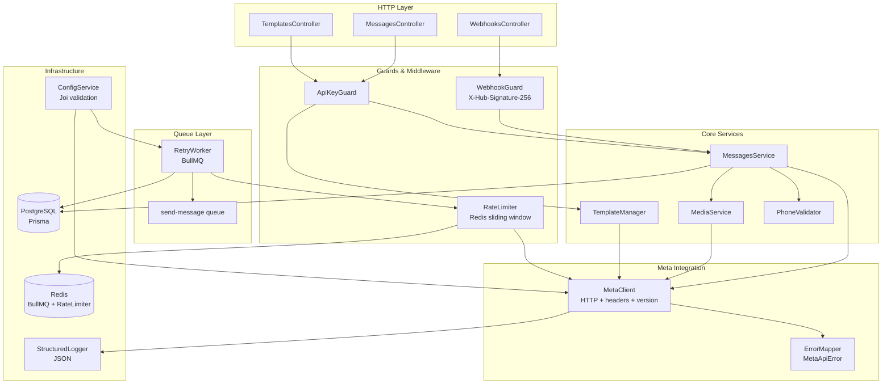
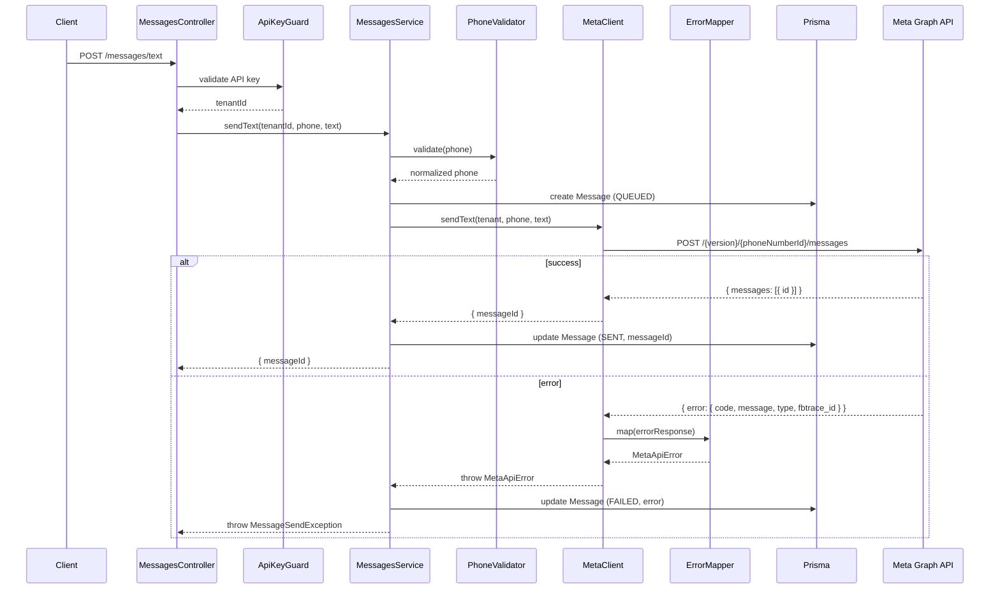
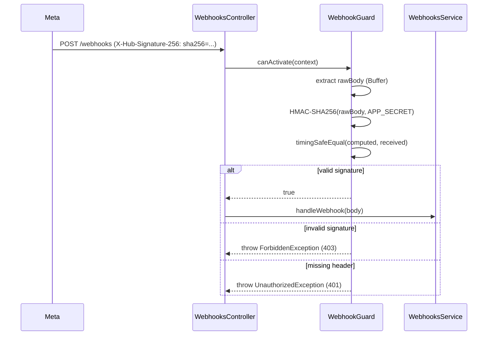

# Design Document: Meta API Integration

## Overview

Este documento describe el diseño técnico para completar la integración con la Meta WhatsApp Business API (Graph API) en el proyecto NestJS existente. El objetivo es reemplazar el código ad-hoc disperso (axios hardcodeado en `WhatsappCoreService`, webhook sin verificación de firma, módulo `messages` vacío) por una arquitectura centralizada, segura y observable.

El diseño introduce:
- `MetaClient`: cliente HTTP centralizado e inyectable para la Graph API
- `WebhookGuard`: guard NestJS que verifica la firma `X-Hub-Signature-256`
- `ErrorMapper`: función pura que normaliza errores de la Graph API
- `RetryWorker`: procesador BullMQ con backoff exponencial
- `MediaService`: construcción de payloads multimedia
- `TemplateManager`: gestión de templates vía WABA API
- `RateLimiter`: sliding window en Redis por tenant
- `PhoneValidator`: validación y normalización E.164
- `MessagesService`: orquestador completo del módulo messages
- Validación de entorno con Joi al arrancar
- Logging estructurado en JSON

---

## Architecture

### Diagrama de componentes



### Flujo de envío de mensaje individual



### Flujo de webhook con verificación de firma



---

## Components and Interfaces

### MetaClient (`src/integrations/meta/meta.client.ts`)

```typescript
@Injectable()
export class MetaClient {
  constructor(
    private readonly config: ConfigService,
    private readonly logger: Logger,
  ) {}

  // Construye base URL: https://graph.facebook.com/{version}/{phoneNumberId}/messages
  private buildUrl(phoneNumberId: string): string

  // Envía mensaje de texto plano
  async sendText(params: MetaSendTextParams): Promise<MetaSendResult>

  // Envía mensaje de template
  async sendTemplate(params: MetaSendTemplateParams): Promise<MetaSendResult>

  // Envía mensaje con media
  async sendMedia(params: MetaSendMediaParams): Promise<MetaSendResult>

  // Operaciones de templates (WABA)
  async listTemplates(wabaId: string, accessToken: string): Promise<MetaTemplate[]>
  async createTemplate(wabaId: string, accessToken: string, template: CreateTemplateDto): Promise<MetaTemplateResult>
  async deleteTemplate(wabaId: string, accessToken: string, name: string): Promise<void>
}
```

**Tipos clave:**

```typescript
interface MetaSendTextParams {
  accessToken: string;
  phoneNumberId: string;
  to: string;
  text: string;
}

interface MetaSendTemplateParams {
  accessToken: string;
  phoneNumberId: string;
  to: string;
  template: string;
  language: string;
  variables?: Record<string, string>;
}

interface MetaSendMediaParams {
  accessToken: string;
  phoneNumberId: string;
  to: string;
  mediaType: 'image' | 'document' | 'audio' | 'video';
  mediaUrl: string;
  caption?: string;
  filename?: string;
}

interface MetaSendResult {
  messageId: string;
}

class MetaApiError extends Error {
  code: number;
  message: string;
  type: string;        // 'WINDOW_EXPIRED' | 'RATE_LIMIT' | string
  fbtrace_id: string;
}
```

### WebhookGuard (`src/modules/webhooks/webhook.guard.ts`)

```typescript
@Injectable()
export class WebhookGuard implements CanActivate {
  canActivate(context: ExecutionContext): boolean
  // Extrae rawBody del request (Buffer)
  // Computa HMAC-SHA256(rawBody, META_APP_SECRET)
  // Compara con timingSafeEqual
  // Lanza UnauthorizedException (401) si falta header
  // Lanza ForbiddenException (403) si firma no coincide
}
```

**Requisito de configuración:** El raw body debe estar disponible como `req.rawBody`. Se configura en `main.ts`:

```typescript
app.use(express.json({
  verify: (req: any, res, buf) => { req.rawBody = buf; }
}));
```

### ErrorMapper (`src/integrations/meta/error-mapper.ts`)

```typescript
export function mapGraphApiError(errorResponse: unknown): MetaApiError

// Mapeos especiales:
// code 131047 → type = 'WINDOW_EXPIRED'
// code 130429 → type = 'RATE_LIMIT'
// otros → type = errorResponse.error.type ?? 'UNKNOWN'
```

### RetryWorker (`src/workers/retry-message.worker.ts`)

```typescript
@Processor('send-message')
export class RetryMessageWorker {
  // Backoff exponencial: 5s, 10s, 20s (máx 3 reintentos)
  // Errores recuperables: timeout, HTTP 5xx, RATE_LIMIT
  // Errores no recuperables: HTTP 4xx (excepto 429), WINDOW_EXPIRED
  // Idempotencia: verifica messageId antes de enviar
}
```

**Configuración BullMQ:**
```typescript
BullModule.registerQueue({
  name: 'send-message',
  defaultJobOptions: {
    attempts: 3,
    backoff: { type: 'exponential', delay: 5000 },
    removeOnComplete: true,
    removeOnFail: false,
  },
})
```

### RateLimiter (`src/integrations/meta/rate-limiter.ts`)

```typescript
@Injectable()
export class RateLimiter {
  // Sliding window en Redis: key = `rate:${tenantId}`, window = 1s, max = 80
  async acquire(tenantId: string): Promise<void>
  // Si RATE_LIMIT error recibido: pausar tenant 60s
  async pauseTenant(tenantId: string, durationMs: number): Promise<void>
  async isTenantPaused(tenantId: string): Promise<boolean>
}
```

### PhoneValidator (`src/common/phone-validator.ts`)

```typescript
export class PhoneValidator {
  // E.164: /^\+[1-9]\d{6,14}$/
  static validate(phone: string): boolean
  static normalize(phone: string): string  // prepend + si falta
  static validateOrThrow(phone: string): string  // normalize + validate, throws ValidationException
}
```

### MessagesService (`src/modules/messages/messages.service.ts`)

```typescript
@Injectable()
export class MessagesService {
  async sendText(tenantId: string, phone: string, text: string): Promise<{ messageId: string }>
  async sendTemplate(tenantId: string, phone: string, template: string, language: string, variables?: Record<string, string>): Promise<{ messageId: string }>
  async sendMedia(tenantId: string, phone: string, mediaType: MediaType, mediaUrl: string, caption?: string, filename?: string): Promise<{ messageId: string }>
}
```

### TemplateManager (`src/modules/templates/template-manager.service.ts`)

```typescript
@Injectable()
export class TemplateManager {
  async list(tenantId: string): Promise<MetaTemplate[]>
  async create(tenantId: string, dto: CreateTemplateDto): Promise<MetaTemplateResult>
  async delete(tenantId: string, name: string): Promise<void>
}
```

### ConfigService con Joi (`src/config/config.validation.ts`)

```typescript
export const validationSchema = Joi.object({
  DATABASE_URL: Joi.string().required(),
  REDIS_HOST: Joi.string().required(),
  REDIS_PORT: Joi.number().port().required(),  // 1-65535
  WHATSAPP_VERIFY_TOKEN: Joi.string().required(),
  META_APP_SECRET: Joi.string().required(),
  META_API_VERSION: Joi.string().pattern(/^v\d+\.\d+$/).required(),
  // Requeridos en producción:
  WHATSAPP_ACCESS_TOKEN: Joi.when('NODE_ENV', {
    is: 'production',
    then: Joi.string().required(),
    otherwise: Joi.string().optional(),
  }),
  WHATSAPP_PHONE_NUMBER_ID: Joi.when('NODE_ENV', {
    is: 'production',
    then: Joi.string().required(),
    otherwise: Joi.string().optional(),
  }),
});
```

---

## Data Models

### Cambios al schema Prisma

Se requieren dos campos adicionales en el modelo `Tenant` y un campo `type` en `Message`:

```prisma
model Tenant {
  // ... campos existentes ...
  wabaId      String?   // WhatsApp Business Account ID para gestión de templates
}

model Message {
  // ... campos existentes ...
  type        String    @default("text")  // text | template | image | document | audio | video
}
```

### Nuevas variables de entorno requeridas

| Variable | Descripción | Ejemplo |
|---|---|---|
| `META_APP_SECRET` | App Secret de Meta para verificar firma del webhook | `abc123...` |
| `META_API_VERSION` | Versión de la Graph API | `v20.0` |
| `REDIS_HOST` | Host de Redis | `localhost` |
| `REDIS_PORT` | Puerto de Redis | `6379` |
| `WHATSAPP_VERIFY_TOKEN` | Token de verificación del webhook | `my-verify-token` |

### Estructura de jobs BullMQ

```typescript
// Queue: 'send-message'
interface SendMessageJob {
  tenantId: string;
  campaignId?: string;
  phone: string;
  template?: string;
  language?: string;
  variables?: Record<string, string>;
  text?: string;
  mediaType?: 'image' | 'document' | 'audio' | 'video';
  mediaUrl?: string;
  caption?: string;
  filename?: string;
  messageDbId: string;  // ID del registro Message en DB (para idempotencia)
}
```

---

## Correctness Properties

*A property is a characteristic or behavior that should hold true across all valid executions of a system — essentially, a formal statement about what the system should do. Properties serve as the bridge between human-readable specifications and machine-verifiable correctness guarantees.*

### Property 1: MetaClient headers invariant

*For any* outgoing request made by MetaClient (text, template, or media), the HTTP request SHALL contain an `Authorization: Bearer {accessToken}` header and a `Content-Type: application/json` header.

**Validates: Requirements 1.2**

---

### Property 2: MetaClient URL version invariant

*For any* request made by MetaClient, the constructed URL SHALL contain the version string obtained from `ConfigService` (e.g., `v20.0`), regardless of the operation type or tenant.

**Validates: Requirements 1.3, 11.4**

---

### Property 3: Webhook signature round-trip

*For any* request body (Buffer) and any `APP_SECRET`, if the `X-Hub-Signature-256` header is computed as `sha256=HMAC-SHA256(body, secret)` and sent with the request, then `WebhookGuard` SHALL allow the request to proceed.

**Validates: Requirements 2.6**

---

### Property 4: Webhook invalid signature rejection

*For any* request body and any signature value that does NOT match `HMAC-SHA256(body, APP_SECRET)`, `WebhookGuard` SHALL reject the request with HTTP 403.

**Validates: Requirements 2.3**

---

### Property 5: ErrorMapper output shape

*For any* Graph API error response object, `mapGraphApiError` SHALL return a `MetaApiError` with all four fields populated: `code` (number), `message` (string), `type` (string), and `fbtrace_id` (string). The `type` field SHALL be `'RATE_LIMIT'` for code 130429 and `'WINDOW_EXPIRED'` for code 131047.

**Validates: Requirements 3.1, 3.4, 3.5**

---

### Property 6: Error propagation to MessageSendException

*For any* `MetaApiError` thrown by MetaClient, `MessagesService` SHALL catch it and rethrow a `MessageSendException` that includes the original `fbtrace_id` and `code`.

**Validates: Requirements 3.3**

---

### Property 7: Retry classification invariant

*For any* failed message job, if the error is recoverable (network timeout, HTTP 5xx, or `type === 'RATE_LIMIT'`), the job SHALL be re-enqueued; if the error is non-recoverable (HTTP 4xx excluding 429, or `type === 'WINDOW_EXPIRED'`), the message SHALL be marked `FAILED` immediately with no re-enqueue.

**Validates: Requirements 4.1, 4.4**

---

### Property 8: Max retry count invariant

*For any* message job that fails on every attempt, after exactly 3 failed attempts the message record in the database SHALL have status `FAILED` and no further retry SHALL be enqueued.

**Validates: Requirements 4.2**

---

### Property 9: Retry job data preservation

*For any* message job that is re-enqueued after a failure, the re-enqueued job SHALL contain the same `tenantId`, `campaignId`, `phone`, and `variables` as the original job.

**Validates: Requirements 4.3**

---

### Property 10: Retry idempotence

*For any* message that has already been successfully sent (status `SENT` in DB), processing the same job again SHALL NOT create a duplicate message in WhatsApp or insert a new `Message` record in the database.

**Validates: Requirements 4.6**

---

### Property 11: Media payload structure

*For any* media message (image, document, audio, video) with a valid HTTPS URL, the payload constructed by `MediaService` SHALL have `type` set to the media type and a nested object keyed by that type containing at minimum the `link` field.

**Validates: Requirements 5.2**

---

### Property 12: Media URL validation

*For any* URL string that does not start with `https://`, `MediaService` SHALL throw a `ValidationException` before making any HTTP call to the Graph API.

**Validates: Requirements 5.5**

---

### Property 13: Template create round-trip

*For any* valid template definition sent to `TemplateManager.create`, the Graph API call SHALL be made to `/{version}/{wabaId}/message_templates` and the returned result SHALL contain an `id` and a `status` field.

**Validates: Requirements 6.2, 6.5**

---

### Property 14: Rate limit invariant (metamorphic)

*For any* number of concurrent BullMQ workers processing messages for the same tenant, the total number of messages sent to the Graph API per second for that tenant SHALL NOT exceed the configured limit (80 msg/s).

**Validates: Requirements 7.1, 7.5**

---

### Property 15: Rate limit pause on RATE_LIMIT error

*For any* tenant that receives a `MetaApiError` with `type === 'RATE_LIMIT'`, all subsequent message sends for that tenant SHALL be blocked for at least 60 seconds before resuming.

**Validates: Requirements 7.3**

---

### Property 16: Phone E.164 round-trip

*For any* string that is a valid E.164 phone number (with or without leading `+`), `PhoneValidator.normalize` followed by `PhoneValidator.validate` SHALL return `true`.

**Validates: Requirements 8.6**

---

### Property 17: Invalid phone throws

*For any* string that cannot be normalized to a valid E.164 format, `PhoneValidator.validateOrThrow` SHALL throw a `ValidationException` with message `'Invalid phone number format'`.

**Validates: Requirements 8.3**

---

### Property 18: Message send and persist round-trip

*For any* successful message send (text, template, or media), the `Message` record in the database SHALL have `status = 'SENT'`, the `messageId` returned by the Graph API, and the correct `type` field matching the message type sent.

**Validates: Requirements 9.1, 9.2, 9.3, 9.4**

---

### Property 19: Message failure persistence

*For any* failed message send, the `Message` record in the database SHALL have `status = 'FAILED'` and the `error` field SHALL be populated with a non-empty description of the failure.

**Validates: Requirements 9.5**

---

### Property 20: Config validation — missing required variables

*For any* subset of the required environment variables that is absent or empty at startup, the application SHALL fail to start and the error message SHALL name the missing variable(s).

**Validates: Requirements 10.2**

---

### Property 21: Config validation — REDIS_PORT range

*For any* value of `REDIS_PORT` that is not an integer in the range [1, 65535], the Joi validation SHALL reject it and prevent application startup.

**Validates: Requirements 10.3**

---

### Property 22: Config validation — META_API_VERSION format

*For any* string value of `META_API_VERSION` that does not match the pattern `v\d+\.\d+`, the Joi validation SHALL reject it and prevent application startup.

**Validates: Requirements 10.4**

---

### Property 23: Structured logger output shape

*For any* outgoing Graph API request, the log entry emitted by `StructuredLogger` SHALL be valid JSON and SHALL contain the fields `tenantId`, `phoneNumberId`, `messageType`, `timestamp`, and `requestId`.

**Validates: Requirements 12.1**

---

## Error Handling

### Jerarquía de errores

```
Error
├── MetaApiError          — errores de la Graph API (code, type, fbtrace_id)
├── MessageSendException  — error de dominio lanzado por MessagesService
├── ValidationException   — errores de validación (E.164, media URL, etc.)
└── ConfigValidationError — errores de Joi al arrancar (NestJS los maneja nativamente)
```

### Tabla de códigos de error Meta → comportamiento

| Código Meta | Tipo asignado | Comportamiento |
|---|---|---|
| 130429 | `RATE_LIMIT` | Retry con pausa de 60s en RateLimiter |
| 131047 | `WINDOW_EXPIRED` | Fallo inmediato, sin retry |
| 4xx (otros) | `CLIENT_ERROR` | Fallo inmediato, sin retry |
| 5xx | `SERVER_ERROR` | Retry con backoff exponencial |
| Timeout | `NETWORK_ERROR` | Retry con backoff exponencial |

### Manejo en el WebhookGuard

- Header ausente → `UnauthorizedException` (401) + log WARN con IP
- Firma inválida → `ForbiddenException` (403) + log WARN con IP
- Firma válida → continúa al handler

### Manejo en el RetryWorker

BullMQ gestiona los reintentos automáticamente mediante `attempts` y `backoff`. El worker solo necesita:
1. Verificar si el error es recuperable antes de lanzarlo (para que BullMQ reintente)
2. Para errores no recuperables: capturar, marcar `FAILED` en DB, y NO relanzar (para que BullMQ no reintente)

---

## Testing Strategy

### Enfoque dual: unit tests + property-based tests

Los unit tests verifican ejemplos concretos, casos borde y condiciones de error. Los property-based tests verifican propiedades universales sobre rangos amplios de inputs generados aleatoriamente. Ambos son complementarios y necesarios.

### Librería de property-based testing

Se usará **`fast-check`** (compatible con Jest, ampliamente adoptado en el ecosistema TypeScript/Node.js):

```bash
npm install --save-dev fast-check
```

Cada property test debe ejecutarse con mínimo **100 iteraciones** (el default de fast-check es 100, no reducir).

### Formato de tag para property tests

Cada test de propiedad debe incluir un comentario de referencia:

```typescript
// Feature: meta-api-integration, Property N: <texto de la propiedad>
```

### Unit tests — ejemplos y casos borde

| Componente | Casos a cubrir |
|---|---|
| `WebhookGuard` | Header ausente → 401; firma incorrecta → 403; firma correcta → pass |
| `ErrorMapper` | code 130429 → RATE_LIMIT; code 131047 → WINDOW_EXPIRED; campo fbtrace_id presente |
| `PhoneValidator` | `+5491112345678` válido; `5491112345678` normalizado; `abc` → throws |
| `ConfigService` | Arranque sin `META_APP_SECRET` → error descriptivo; `REDIS_PORT=99999` → error |
| `MessagesController` | Sin API key → 401; body inválido → 400 |
| `TemplateManager` | Error de Graph API → HTTP 422 con MetaApiError |

### Property-based tests — implementación

Cada propiedad del diseño debe implementarse como un único test de propiedad:

```typescript
// Feature: meta-api-integration, Property 3: Webhook signature round-trip
it('should accept any payload signed with the correct secret', () => {
  fc.assert(fc.asyncProperty(
    fc.uint8Array({ minLength: 1, maxLength: 10000 }),
    fc.string({ minLength: 10 }),
    async (body, secret) => {
      const sig = 'sha256=' + createHmac('sha256', secret).update(body).digest('hex');
      const result = await guard.canActivate(mockContext(body, sig, secret));
      expect(result).toBe(true);
    }
  ), { numRuns: 100 });
});
```

```typescript
// Feature: meta-api-integration, Property 16: Phone E.164 round-trip
it('should validate any normalized E.164 number', () => {
  fc.assert(fc.property(
    fc.stringMatching(/^\+[1-9]\d{6,14}$/),
    (phone) => {
      const normalized = PhoneValidator.normalize(phone);
      expect(PhoneValidator.validate(normalized)).toBe(true);
    }
  ), { numRuns: 100 });
});
```

```typescript
// Feature: meta-api-integration, Property 5: ErrorMapper output shape
it('should always produce a MetaApiError with all required fields', () => {
  fc.assert(fc.property(
    fc.record({
      error: fc.record({
        code: fc.integer(),
        message: fc.string(),
        type: fc.string(),
        fbtrace_id: fc.string(),
      })
    }),
    (errorResponse) => {
      const result = mapGraphApiError(errorResponse);
      expect(result).toBeInstanceOf(MetaApiError);
      expect(typeof result.code).toBe('number');
      expect(typeof result.message).toBe('string');
      expect(typeof result.type).toBe('string');
      expect(typeof result.fbtrace_id).toBe('string');
    }
  ), { numRuns: 100 });
});
```

### Cobertura esperada

- `MetaClient`: property tests P1, P2 (mock axios, verificar headers y URL)
- `WebhookGuard`: property tests P3, P4
- `ErrorMapper`: property test P5 (función pura, fácil de testear)
- `MessagesService`: property tests P6, P18, P19 (mock MetaClient y Prisma)
- `RetryWorker`: property tests P7, P8, P9, P10 (mock BullMQ job)
- `MediaService`: property tests P11, P12
- `TemplateManager`: property test P13
- `RateLimiter`: property tests P14, P15 (mock Redis)
- `PhoneValidator`: property tests P16, P17 (función pura)
- `ConfigService`: property tests P20, P21, P22
- `StructuredLogger`: property test P23 (mock Logger, verificar JSON output)
