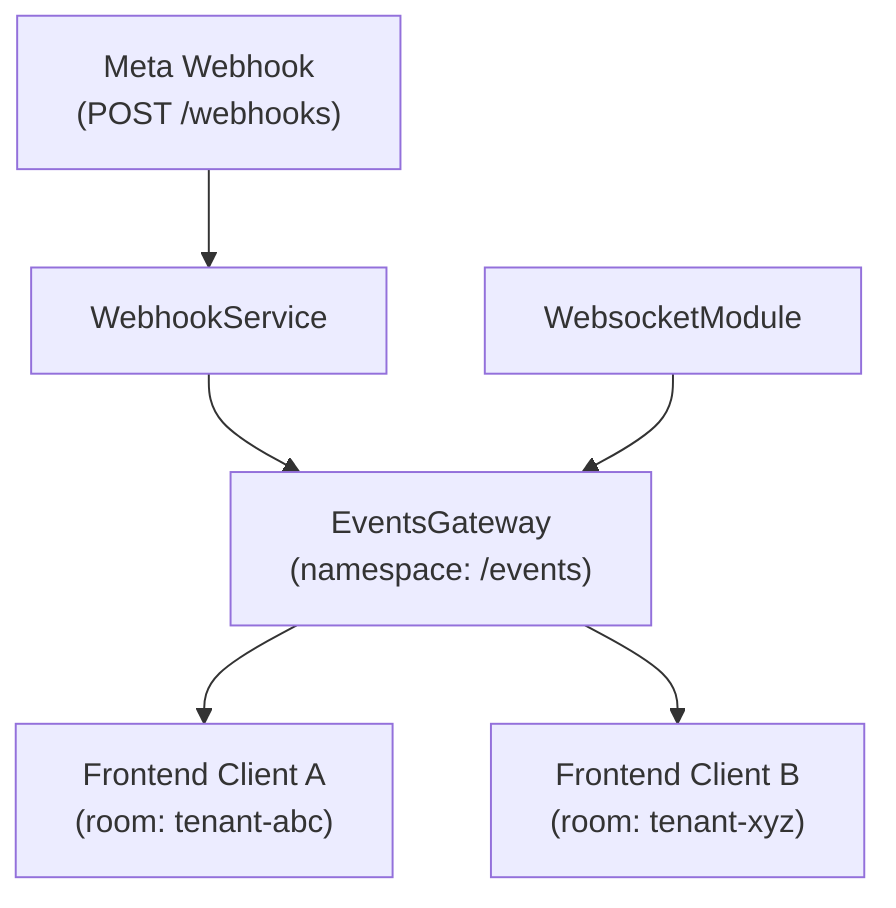

# Diseño Técnico: WebSocket Gateway

## Overview

El WebSocket Gateway es un módulo NestJS que expone un servidor Socket.IO en el namespace `/events`. Su responsabilidad es notificar a clientes frontend en tiempo real sobre eventos de mensajería: mensajes entrantes de WhatsApp y cambios de estado de mensajes salientes.

El diseño prioriza la integración no intrusiva: el gateway se expone como un proveedor inyectable con una API mínima (`emitToTenant`), de modo que los módulos existentes (`WebhooksModule`, `MessagesModule`, `CampaignsModule`) pueden emitir eventos sin acoplarse a Socket.IO directamente.

El proyecto ya tiene `fast-check` como dependencia de desarrollo (PBT library). Para Socket.IO se añadirán `@nestjs/websockets`, `@nestjs/platform-socket.io` y `socket.io`.

---

## Architecture



El flujo principal es:
1. Meta envía un webhook al `WebhookController`.
2. `WebhookService` procesa el payload y llama a `EventsGateway.emitToTenant(tenantId, event, payload)`.
3. `EventsGateway` emite el evento a la sala Socket.IO correspondiente al `tenantId`.
4. Los clientes suscritos a esa sala reciben el evento en tiempo real.

---

## Components and Interfaces

### EventsGateway

Clase decorada con `@WebSocketGateway` que implementa `OnGatewayInit`, `OnGatewayConnection` y `OnGatewayDisconnect`.

```typescript
@WebSocketGateway({ namespace: '/events', cors: { origin: '*' } })
export class EventsGateway implements OnGatewayInit, OnGatewayConnection, OnGatewayDisconnect {
  @WebSocketServer() server: Server;

  // Llamado por otros servicios para emitir eventos a una sala
  emitToTenant(tenantId: string, event: string, payload: object): void;

  // Maneja suscripción del cliente a la sala del tenant
  @SubscribeMessage('subscribe')
  handleSubscribe(client: Socket, tenantId: string): void;

  // Maneja desuscripción del cliente de la sala del tenant
  @SubscribeMessage('unsubscribe')
  handleUnsubscribe(client: Socket, tenantId: string): void;
}
```

**Método `emitToTenant`**: Si `this.server` no está inicializado (antes del bootstrap), registra una advertencia con el Logger de NestJS y retorna sin lanzar excepción.

### WebsocketModule

Módulo NestJS que declara y exporta `EventsGateway`.

```typescript
@Module({
  providers: [EventsGateway],
  exports: [EventsGateway],
})
export class WebsocketModule {}
```

### Integración con WebhookService

`WebhooksModule` importa `WebsocketModule` e inyecta `EventsGateway` en `WebhookService`:

```typescript
// En handleIncomingMessage:
this.eventsGateway.emitToTenant(tenant.id, 'incoming_message', {
  messageId,
  from,
  type,
  text,
  tenantId: tenant.id,
});

// En handleStatus:
this.eventsGateway.emitToTenant(tenantId, 'message_status', {
  messageId,
  status: newStatus,
  tenantId,
  ...(error ? { error } : {}),
});
```

> Nota: Para `handleStatus`, el `tenantId` se obtiene consultando la BD por `messageId` antes de emitir.

---

## Data Models

### Payload: `incoming_message`

```typescript
interface IncomingMessagePayload {
  messageId: string;   // ID del mensaje de Meta
  from: string;        // Número de teléfono del remitente
  type: string;        // Tipo de mensaje: 'text', 'image', etc.
  text: string | null; // Cuerpo del mensaje (null si no es texto)
  tenantId: string;    // ID del tenant receptor
}
```

### Payload: `message_status`

```typescript
interface MessageStatusPayload {
  messageId: string;  // ID del mensaje de Meta
  status: string;     // 'SENT' | 'DELIVERED' | 'READ' | 'FAILED'
  tenantId: string;   // ID del tenant propietario del mensaje
  error?: string;     // Presente solo cuando status === 'FAILED'
}
```

### Eventos de cliente → servidor

| Evento        | Payload    | Descripción                                      |
|---------------|------------|--------------------------------------------------|
| `subscribe`   | `tenantId` | Une al socket a la sala `tenantId`               |
| `unsubscribe` | `tenantId` | Remueve al socket de la sala `tenantId`          |

### Salas (Rooms)

Las salas se nombran directamente con el `tenantId` (string UUID). No se usa ningún prefijo adicional para mantener la simplicidad.

---


## Correctness Properties

*A property is a characteristic or behavior that should hold true across all valid executions of a system — essentially, a formal statement about what the system should do. Properties serve as the bridge between human-readable specifications and machine-verifiable correctness guarantees.*

### Property 1: Subscribe une al cliente a la sala del tenant

*For any* `tenantId` válido (string no vacío), cuando un cliente emite el evento `subscribe` con ese `tenantId`, el socket del cliente debe pertenecer a la sala identificada por ese `tenantId`.

**Validates: Requirements 2.1**

### Property 2: Subscribe → Unsubscribe es un round-trip

*For any* `tenantId` válido, si un cliente se suscribe a la sala y luego se desuscribe, el socket del cliente no debe pertenecer a esa sala.

**Validates: Requirements 2.2**

### Property 3: Payload de `incoming_message` contiene todos los campos requeridos

*For any* mensaje entrante con `messageId`, `from`, `type`, `text` y `tenantId`, cuando `emitToTenant` es invocado con el evento `incoming_message`, el payload emitido a la sala debe contener exactamente los campos `messageId`, `from`, `type`, `text` y `tenantId` con los valores correctos. Esto debe sostenerse incluso cuando la sala no tiene clientes suscritos (no debe lanzar excepción).

**Validates: Requirements 3.1, 3.2, 3.3**

### Property 4: Payload de `message_status` contiene todos los campos requeridos

*For any* cambio de estado con `messageId`, `status` y `tenantId`, cuando `emitToTenant` es invocado con el evento `message_status`, el payload emitido debe contener `messageId`, `status` y `tenantId`. Adicionalmente, si `status === 'FAILED'`, el payload debe incluir el campo `error`.

**Validates: Requirements 4.1, 4.2, 4.3**

---

## Error Handling

### Servidor no inicializado

`emitToTenant` verifica `this.server` antes de emitir. Si es `undefined` (antes del bootstrap de NestJS), registra una advertencia con `Logger.warn` y retorna sin lanzar excepción. Esto protege contra condiciones de carrera durante el arranque.

```typescript
emitToTenant(tenantId: string, event: string, payload: object): void {
  if (!this.server) {
    this.logger.warn(`emitToTenant called before server init: event=${event}, tenantId=${tenantId}`);
    return;
  }
  this.server.to(tenantId).emit(event, payload);
}
```

### Subscribe sin tenantId

`handleSubscribe` valida que el `tenantId` recibido sea un string no vacío. Si no lo es, retorna sin unir al cliente a ninguna sala y sin emitir error a otros clientes.

### Tenant no encontrado en handleStatus

`WebhookService.handleStatus` actualmente actualiza mensajes por `messageId` sin conocer el `tenantId`. Para emitir el evento `message_status`, se añade una consulta para obtener el `tenantId` del mensaje antes de llamar a `emitToTenant`. Si el mensaje no existe en BD, se omite la emisión del evento WebSocket (el webhook ya fue procesado).

### Errores de Socket.IO

Los errores internos de Socket.IO (p.ej. cliente desconectado durante emisión) son manejados por la librería y no propagan excepciones al código de aplicación.

---

## Testing Strategy

### Enfoque dual: Unit Tests + Property-Based Tests

Ambos tipos son complementarios y necesarios para cobertura completa.

**Unit Tests** — casos concretos y condiciones de borde:
- Verificar que `EventsGateway` está decorado con `@WebSocketGateway({ namespace: '/events', cors: { origin: '*' } })`.
- Verificar que `WebsocketModule` exporta `EventsGateway`.
- Verificar que `emitToTenant` no lanza excepción cuando `this.server` es `undefined` (Req 5.4).
- Verificar que `handleSubscribe` ignora `tenantId` vacío o nulo (Req 2.3).
- Verificar que el payload de `message_status` incluye `error` cuando `status === 'FAILED'` (Req 4.3).

**Property-Based Tests** — propiedades universales con `fast-check` (ya incluido en devDependencies):
- Mínimo 100 iteraciones por propiedad.
- Cada test referencia la propiedad del diseño en un comentario.

#### Configuración de property tests

```typescript
// Feature: websocket-gateway, Property 1: Subscribe une al cliente a la sala del tenant
fc.assert(fc.property(fc.uuid(), (tenantId) => {
  // generar socket mock, emitir subscribe, verificar rooms
}), { numRuns: 100 });
```

#### Cobertura por propiedad

| Propiedad | Tipo de test | Librería |
|-----------|-------------|---------|
| P1: Subscribe une a sala | Property | fast-check |
| P2: Subscribe/Unsubscribe round-trip | Property | fast-check |
| P3: Payload incoming_message completo | Property | fast-check |
| P4: Payload message_status completo + FAILED | Property | fast-check |
| Req 1.1: Namespace `/events` | Unit (example) | Jest |
| Req 1.4: CORS `origin: *` | Unit (example) | Jest |
| Req 5.1-5.3: Módulo exportable | Unit (example) | Jest |
| Req 5.4: emitToTenant antes de init | Unit (example) | Jest |

#### Estrategia de mocking

Los tests de `EventsGateway` usan un mock del `Server` de Socket.IO para evitar levantar un servidor real. El mock expone `to(room).emit(event, payload)` y permite inspeccionar las llamadas.

Los tests de integración de `WebhookService` mockean `EventsGateway` para verificar que `emitToTenant` es llamado con los argumentos correctos al procesar webhooks.
